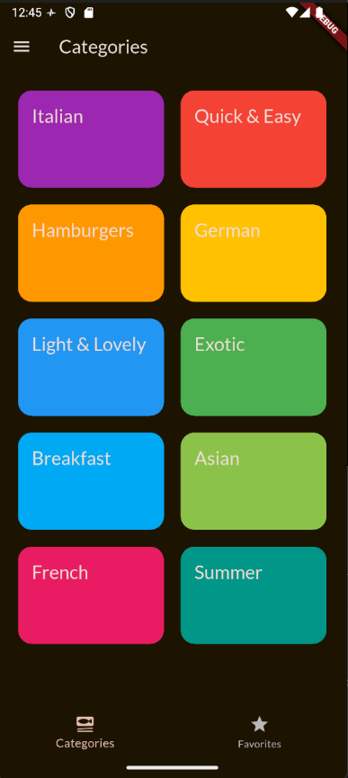
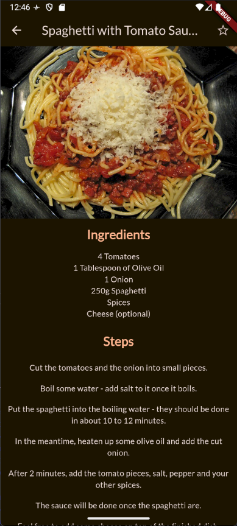
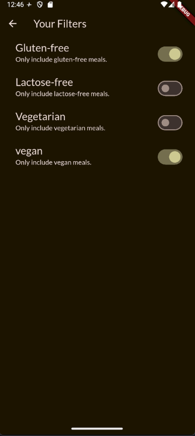

# 🍳 Meals Explorer - Culinary Discovery App


A feature-rich Flutter application designed for culinary enthusiasts to discover recipes, filter meals based on dietary preferences, and manage personal favorites. This project demonstrates modern Android development practices using **Flutter** and **Riverpod**.

## 📸 Screenshots
<p align="center">
  
  
  
</p>

## ✨ Key Features

* **🥗 Smart Filtering System:** Advanced logic to filter meals by dietary requirements (Gluten-free, Lactose-free, Vegan, Vegetarian) in real-time.
* **❤️ Favorites Management:** Seamlessly mark/unmark favorite dishes with instant state synchronization across the app.
* **🎨 Complex UI & Navigation:**
    * Multi-level navigation using **BottomNavigationBar** and **Drawer**.
    * Interactive **Hero Animations** for smooth transitions between list and detail views.
    * Custom **Explicit Animations** (SlideTransition) for category loading.

## 🛠 Technical Highlights

This project focuses on **Clean Code** and **Scalability**:

* **State Management (Riverpod):**
    * Utilized `StateNotifierProvider` to decouple business logic from UI.
    * Managed complex global states (Filters & Favorites) efficiently without context dependency.
* **Architecture:**
    * **Component-Based Design:** UI is broken down into reusable widgets (`MealItem`, `CategoryGridItem`) for better maintainability.
    * **Separation of Concerns:** Distinct separation between Data Models, Providers (Logic), and Screens (UI).

## 🚀 Getting Started

1.  Clone the repository:
    ```bash
    git clone [https://github.com/your-username/meals-explorer.git](https://github.com/your-username/meals-explorer.git)
    ```
2.  Install dependencies:
    ```bash
    flutter pub get
    ```
3.  Run the app:
    ```bash
    flutter run
    ```
